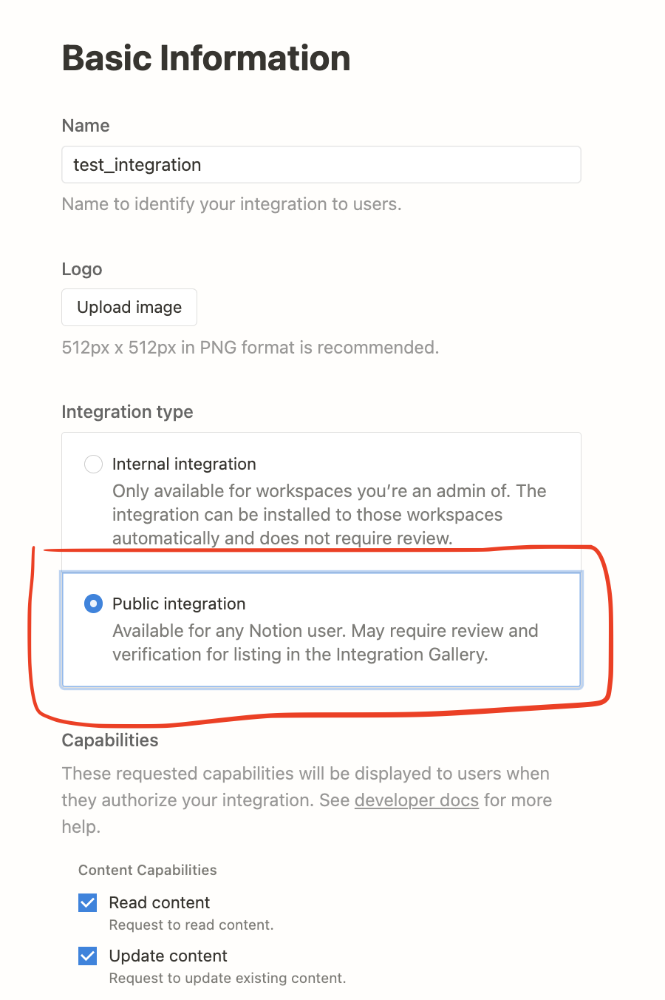
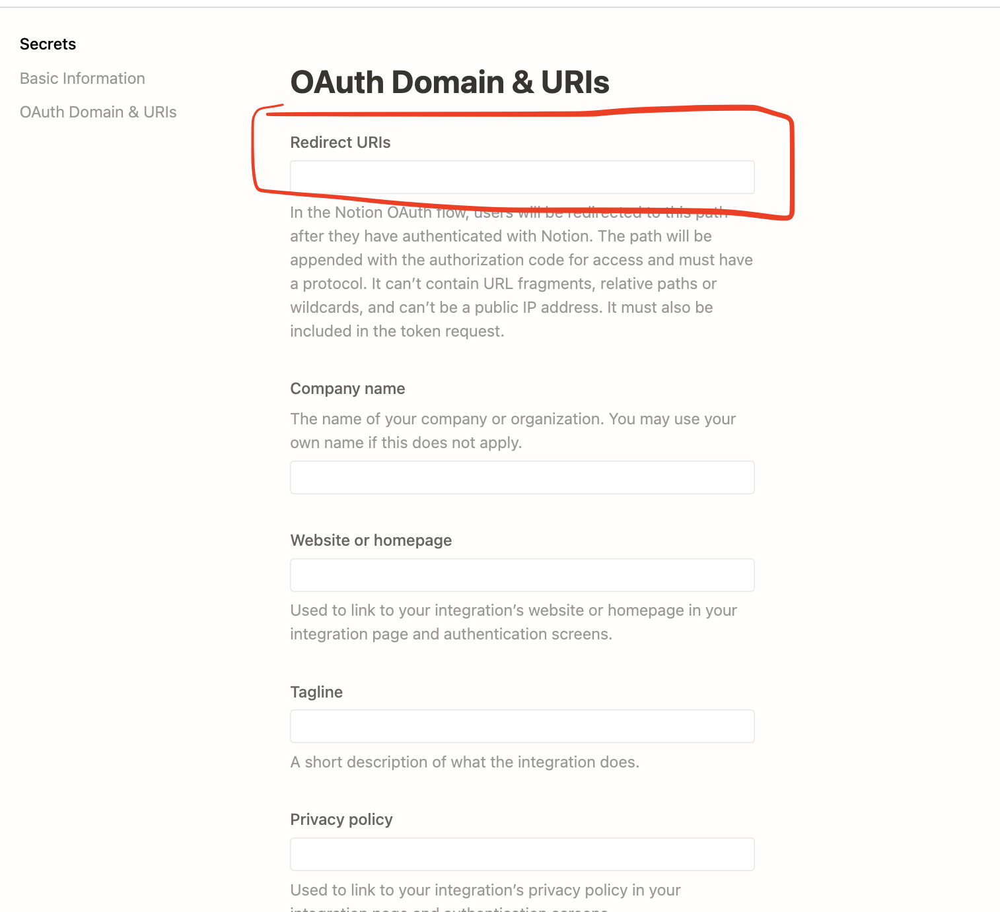

# browser extension for Notion

connect browser with Notion, and bootstraped by [Plasmo](https://docs.plasmo.com/)

## features till now

- auto-sync bookmark to Notion

  ...

## use

<video width="300px" controls>
  <source src='https://player.bilibili.com/player.html?high_quality=1&bvid=BV1dM411a7gx'/>
</video>

download this [package](./packages_to_open/chrome-mv3-prod.zip), then unZip it and install it on Chrome like other Chrome extension.

how to install extension on browser? follow these steps:

1. open 'chrome://extensions/' on Chrome
2. open 'develop mode'
3. click 'Load unpacked extension', select the unZiped extension.
4. done

for Edge/Brave/Opera which based on Chromium, select this [package](./packages_to_open/chrome-mv3-prod.zip)

for Firefox, select this [package](./packages_to_open/firefox-mv2-prod.zip)

## dev

### pre-requist

#### 1.Notion OAuth2.0

first, we set a Notion integration to get OAuth2.0 client token that let our program is access to Notion data.Go to [My integration - Notion](https://www.notion.so/my-integrations) to create a new integration.

**note**:

1. we select 'Public integration' for 'Integration type'
   

2. for 'Redirect URIs', we input the url of Notion OAuth2.0 callback page, which will be explained bellow in sencod point.

   

3. create .env file at root dir, then write these 2 env variable:

```shell
NOTION_AUTH_CLIENT_SECRET = xxxxxxx
NOTION_AUTH_CALLBACK_PAGE_URL = https://xxxxxx
```

`NOTION_AUTH_CLIENT_SECRET ` is the Notion OAuth2.0 client secret,
`NOTION_AUTH_CALLBACK_PAGE_URL` is the domain of Notion oauth callback page.

after we finish to create integration, we get these 3 value: **OAuth client ID**, **OAuth client secret**, Authorization URL. we will use **Auth client ID** and **OAuth client secret** in programing.For hoow to use them, can reference this [Notion devlopment doc](https://developers.notion.com/docs/authorization#set-up-the-auth-flow-for-a-public-integration).But note!!!! there is a big issue from Notion official api, we should not set param `redirect url`, I found it after very a long time search.

 

#### 2. A callback page for Notion Auth2.0

this project depends on Notion authorization, so we must have a server to receive Notion Oauth2.0 callback.For this, I add a server-rendered page on my Next.js project that is hosted by vercel, you can also do the same.My page code like below, it handles the Notion account info and token, we should persist this token so that we can send some request to Notion to read and write some Notion pages, such as send it with cookie:

```javascript
import axios from "axios"
//@ts-ignore
import cookie from "cookie"
import {
  GetServerSideProps,
  GetServerSidePropsContext,
  GetServerSidePropsResult
} from "next"
import Image from "next/image"
import * as React from "react"

import bookmarkExtensionIcon from "../assets/img/bookmark-extersion-icon.png"

export default function NotionAuth(props: any) {
  React.useEffect(() => {
    const t = setTimeout(() => {
      window.close()
    }, 4000)
    return () => {
      clearTimeout(t)
    }
  }, [props])
  return (
    <div
      style={{
        backgroundColor: "#fff",
        width: "100vw",
        height: "100vh",
        display: "flex",
        justifyContent: "center",
        alignItems: "center",
        flexDirection: "column"
      }}>
      <Image src={bookmarkExtensionIcon} width={100} height={100} alt="" />
      <h1 style={{ color: "rgb(54, 212, 70)" }}>success to login in Notion!</h1>
      <h2>
        Now try to click the icon in the upper right corner of your browser to
        open the pop-up window
      </h2>
    </div>
  )
}
export async function getServerSideProps(
  ctx: GetServerSidePropsContext
): Promise<GetServerSidePropsResult<any>> {
  let oauthInfo = {}
  try {
    const res = await axios({
      method: "post",
      url: "https://api.notion.com/v1/oauth/token",
      data: {
        grant_type: "authorization_code",
        code: ctx.query?.code
      },
      headers: {
        "Content-Type": "application/json",
        Authorization: `Basic ${Buffer.from(
          `${process.env.notion_auth_client_id_for_bookmark_ext}:${process.env.notion_auth_client_secret_for_bookmark_ext}`
        ).toString("base64")}`
      }
    })
    oauthInfo = {
      access_token: res.data.access_token,
      token_type: res.data.token_type,
      bot_id: res.data.bot_id,
      workspace_name: res.data.workspace_name,
      workspace_icon: res.data.workspace_icon,
      workspace_id: res.data.workspace_id,
      ownerUsername: res.data.owner?.user?.name,
      ownerUserId: res.data.owner?.user?.id,
      ownerUserAvatarUrl: res.data.owner?.user?.avatar_url,
      ownerUserEmail: res.data.owner?.user?.person?.email
    }
  } catch (err) {
    console.error(err)
  }

  ctx.res.setHeader(
    "Set-Cookie",
    cookie.serialize("oauthInfo", JSON.stringify(oauthInfo), {
      httpOnly: false,
      hostOnly: false
    })
  )
  return {
    props: {}
  }
}
```

### start to dev

start the local dev server

```shell
$pnpm dev
```

reference [Plasmo doc](https://docs.plasmo.com/framework/workflows/dev)

## some special logic in code

1. queue the response to update of bookmark, because updates can be frequent and there can be many updates in a short period of time. We should send these updates in serial to avoid the conflict write on Notion.

   <details>
   <summary> code </summary>

   ```js
   // utils/promise.ts
   class DynamicSerialExcutePromise<P extends () => Promise<any>> {
     private preExcutionPromise: Promise<any>
     public serialExcute = async (promiseLoader: P) => {
       await this.preExcutionPromise
       this.preExcutionPromise = promiseLoader()
       return this.preExcutionPromise
     }
   }

   const dynamicQueueExcuteSyncBookmarkPromises = new DynamicSerialExcutePromise()
   export const queueExcuteSyncBookmarkPromises = (
     syncBookmarkPromiseLoader: () => Promise<any>
   ) => {
     return dynamicQueueExcuteSyncBookmarkPromises.serialExcute(
       syncBookmarkPromiseLoader
     )
   }
   ```

   </details>

2. Notion API allows devloper to send max 2 layer of nodes to create block tree, so we should split our tree and send it layer by layer.

   <details>
   <summary> code </summary>

   ```javascript
   // utils/notion/_exportBookmarkToNotionPage.ts
   async function convertBookMarkTreeToNotionToggleBlock(
     treeNodes: BookmarkTreeNode[],
     parentBlockId: string,
     handleNodesSameParent: (
       blocks: BlockObjectRequest[],
       parentBlockId: string
     ) => Promise<{ nodeBlockIds: string[] }>
   ) {
     let leaveNodes = []
     const blockIds = await serialExcutePromises(
       treeNodes.map((node) => {
         return async () => {
           if (node.children) {
             // bookmark directory
             const { nodeBlockIds } = await handleNodesSameParent(
               [
                 {
                   type: "toggle",
                   toggle: {
                     rich_text: [
                       {
                         text: {
                           content: node.title
                         }
                       }
                     ]
                   }
                 }
               ],
               parentBlockId
             )
             await convertBookMarkTreeToNotionToggleBlock(
               node.children,
               nodeBlockIds[0],
               handleNodesSameParent
             )
             return nodeBlockIds
           } else {
             // bookmark
             // validate url
             const isUrlValid = node.extra.url?.match(/^https?/)
             leaveNodes.push({
               type: "bulleted_list_item",
               bulleted_list_item: {
                 rich_text: [
                   {
                     text: isUrlValid
                       ? {
                           content: node.title,
                           link: { url: node.extra.url }
                         }
                       : {
                           content: node.title
                         },
                     annotations: {
                       color: "blue"
                     }
                   },
                   {
                     text: {
                       content: `    add at ${new Date(
                         node.extra.addTime
                       ).toLocaleDateString()}`
                     },
                     annotations: {
                       color: "gray",
                       italic: true
                     }
                   }
                 ].concat(
                   isUrlValid
                     ? []
                     : [
                         {
                           text: {
                             content: `  invalid url (${node.extra.url})`
                           },
                           annotations: {
                             color: "red"
                           }
                         }
                       ]
                 )
               }
             })
             return undefined
           }
         }
       })
     )
     const { nodeBlockIds } = leaveNodes.length
       ? await handleNodesSameParent(leaveNodes, parentBlockId)
       : { nodeBlockIds: [] }
     return nodeBlockIds.concat(blockIds.flat().filter((i) => !!i))
   }
   ```

   </details>
