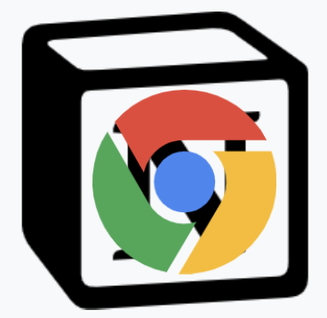

# browser extension for Notion

connect browser with Notion.
This project bootstraped by [Plasmo](https://docs.plasmo.com/)

## features till now

- auto-sync bookmark to Notion

  ...

## use

download this [package](./packages_to_open//chrome-mv3-prod.zip), then unZip it and install it on Chrome like other Chrome extension.

how to install extension on browser? follow these steps:

1. open 'chrome://extensions/' on Chrome
2. open 'develop mode'
3. click 'Load unpacked extension', select the unZiped extension.
4. done

for Firefox, select this [package](./packages_to_open/firefox-mv2-prod.zip)

for Edge, select this [package](./packages_to_open/edge-mv3-prod.zip)

## dev

first, this project depends on Notion authorization, so we must have a server to receive Notion Oauth2.0 callback.For this, I add a server-rendered page on my Next.js project that is hosted by vercel, you can also do the same.My page code like below, it handles the Notion account info and token, we should persist this token so that we can send some request to Notion to read and write some Notion pages, such as send it with cookie:

```javascript
import axios from "axios"
//@ts-ignore
import cookie from "cookie"
import {
  GetServerSideProps,
  GetServerSidePropsContext,
  GetServerSidePropsResult
} from "next"
import Image from "next/image"
import * as React from "react"

import bookmarkExtensionIcon from "../assets/img/bookmark-extersion-icon.png"

export default function NotionAuth(props: any) {
  React.useEffect(() => {
    const t = setTimeout(() => {
      window.close()
    }, 4000)
    return () => {
      clearTimeout(t)
    }
  }, [props])
  return (
    <div
      style={{
        backgroundColor: "#fff",
        width: "100vw",
        height: "100vh",
        display: "flex",
        justifyContent: "center",
        alignItems: "center",
        flexDirection: "column"
      }}>
      <Image src={bookmarkExtensionIcon} width={100} height={100} alt="" />
      <h1 style={{ color: "rgb(54, 212, 70)" }}>success to login in Notion!</h1>
      <h2>
        Now try to click the icon in the upper right corner of your browser to
        open the pop-up window
      </h2>
    </div>
  )
}
export async function getServerSideProps(
  ctx: GetServerSidePropsContext
): Promise<GetServerSidePropsResult<any>> {
  let oauthInfo = {}
  try {
    const res = await axios({
      method: "post",
      url: "https://api.notion.com/v1/oauth/token",
      data: {
        grant_type: "authorization_code",
        code: ctx.query?.code
        // redirect_uri: "https://www.chegi.fun",
      },
      headers: {
        "Content-Type": "application/json",
        Authorization: `Basic ${Buffer.from(
          `${process.env.notion_auth_client_id_for_bookmark_ext}:${process.env.notion_auth_client_secret_for_bookmark_ext}`
        ).toString("base64")}`
      }
    })
    oauthInfo = {
      access_token: res.data.access_token,
      token_type: res.data.token_type,
      bot_id: res.data.bot_id,
      workspace_name: res.data.workspace_name,
      workspace_icon: res.data.workspace_icon,
      workspace_id: res.data.workspace_id,
      ownerUsername: res.data.owner?.user?.name,
      ownerUserId: res.data.owner?.user?.id,
      ownerUserAvatarUrl: res.data.owner?.user?.avatar_url,
      ownerUserEmail: res.data.owner?.user?.person?.email
    }
  } catch (err) {
    console.error(err)
  }

  ctx.res.setHeader(
    "Set-Cookie",
    cookie.serialize("oauthInfo", JSON.stringify(oauthInfo), {
      httpOnly: false,
      hostOnly: false
    })
  )
  return {
    props: {}
  }
}
```

start the local dev server

```shell
$pnpm dev
```
