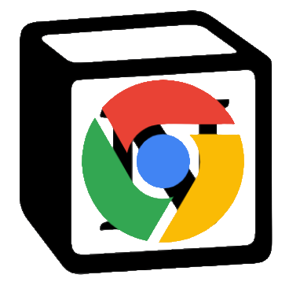

# browser extension for Notion

connect browser with Notion.
This project start with [Plasmo](https://docs.plasmo.com/)

## features till now

- auto-sync bookmark to Notion

  ...

## dev

first, this project depend on Notion authorization, so we must have a server to receive Notion Oauth2.0 callback.For this, I add a server-rendered page on my Next.js project that is hosted by vercel, you can also do the same.My page code like:

```javascript
import axios from "axios"
import {
  GetServerSideProps,
  GetServerSidePropsContext,
  GetServerSidePropsResult
} from "next"
import * as React from "react"

export default function Forward(props: any) {
  React.useEffect(() => {
    window.postMessage(JSON.stringify(props), "*")
  }, [props])
  return <div>forward to browser bookmark saver...</div>
}

const notion_client_id = process.env.notion_client_id
const notion_client_secret = process.env.notion_client_secret

export async function getServerSideProps(
  ctx: GetServerSidePropsContext
): Promise<GetServerSidePropsResult<any>> {
  const qs = Object.entries(ctx.query || {}).reduce((str, [k, v]) => {
    if (!str) {
      return k + "=" + v
    }
    return str + "&" + k + "=" + v
  }, "")
  console.log({ qs })
  let oauthInfo = {}
  try {
    const res = await axios({
      method: "post",
      url: "https://api.notion.com/v1/oauth/token",
      data: {
        grant_type: "authorization_code",
        code: ctx.query?.code
      },
      headers: {
        "Content-Type": "application/json",
        Authorization: `Basic ${Buffer.from(
          `${notion_client_id}:${notion_client_secret}`
        ).toString("base64")}`
      }
    })
    oauthInfo = {
      access_token: res.data.access_token,
      token_type: res.data.token_type,
      bot_id: res.data.bot_id,
      workspace_name: res.data.workspace_name,
      workspace_icon: res.data.workspace_icon,
      workspace_id: res.data.workspace_id,
      ownerUsername: res.data.owner?.user?.name,
      ownerUserId: res.data.owner?.user?.id,
      ownerUserAvatarUrl: res.data.owner?.user?.avatar_url,
      ownerUserEmail: res.data.owner?.user?.person?.email
    }
  } catch (err) {
    console.error(err)
  }
  const oauthToQs = JSON.stringify(oauthInfo)

  return {
    props: {
      oauthInfo
    },
    redirect: {
      //TODO: destination 应该需要在发起 notion 授权时带上，然后这歌页面接受，再在这里返回，而不是写死
      destination: `chrome-extension://${extensionId}/tabs/notionOauthCallbackpage.html?oauthToQs=${encodeURIComponent(
        oauthToQs
      )}`,
      permanent: true
    }
  }
}
```

start the local dev server

```shell
$pnpm dev
```
